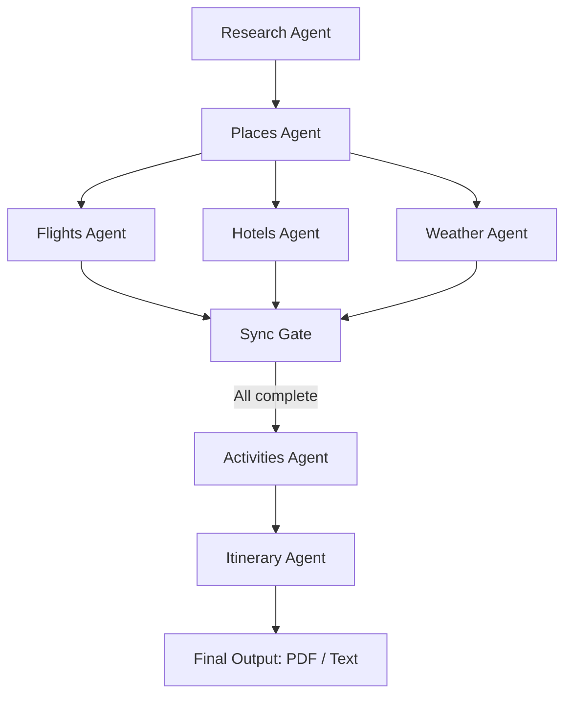

# 🌍 AI Multi-Agent Trip Advisor

An intelligent trip planning app powered by **LangGraph**, **Google Gemini API**, **Tavily API**, and **Wikipedia**.  
This system uses multiple specialized agents (research, flights, hotels, weather, activities, itinerary) orchestrated via LangGraph to design a personalized travel itinerary.  
The app generates detailed itineraries with PDFs and real-time travel insights.

---

## 🚀 Features
- 🤖 **Multi-Agent Orchestration** using LangGraph  
- 🗺️ **Destination Research** (Wikipedia + Tavily search)  
- 🌦️ **Weather Forecasts**  
- ✈️ **Flight Options**  
- 🏨 **Hotel Recommendations**  
- 🎯 **Activity Suggestions** based on interests  
- 📋 **Final AI-Generated Itinerary**  
- 📄 **PDF Export** 

---

## 🖼️ Screenshots

### Workflow Diagram


## 🖼️ Screenshots

### App UI

(./demo/UI.png)
(./demo/preparing_trip.png)
(./demo/image1.png)
(./demo/image2.png)
(./demo/image3.png)
(./demo/image4.png)
(./demo/image5.png)
(./demo/image6.png)
(./demo/image7.png)
(./demo/image8.png)
(./demo/image9.png)
(./demo/image10.png)
(./demo/image11.png)
(./demo/image12.png)
(./demo/image13.png)


## 📦 Installation

### 1. Clone the repository
```bash
git clone https://github.com/sakshivedi-1/MULTI_AGENT_TRIP_PLANNER.git
cd ai-trip-advisor
```

### 2. Create a Python environment (Python 3.10 recommended)
```bash
python -m venv .venv
source .venv/bin/activate   # On Linux/Mac
.venv\Scripts\activate      # On Windows
```

### 3. Install dependencies
```bash
pip install -r requirements.txt
```

---

## 🔑 API Keys Setup

The app requires **Google Gemini**, **Tavily**, and optional **Gmail SMTP** credentials.

### Create a `.env` file in the project root:
```ini
GOOGLE_API_KEY="your_google_gemini_api_key"
TAVILY_API_KEY="your_tavily_api_key"
```

### Configure Streamlit secrets in `.streamlit/secrets.toml`:
```toml
GOOGLE_API_KEY = "your_google_gemini_api_key"
TAVILY_API_KEY = "your_tavily_api_key"


```

---

## ▶️ Run the App

```bash
streamlit run app.py
```

The app will launch in your browser (default: `http://localhost:8501`).

---

## 📚 Tech Stack

* **LangGraph** → Multi-agent orchestration  
* **LangChain** → LLM pipeline integration  
* **Google Gemini API** → LLM for reasoning and itinerary generation  
* **Tavily API** → Web search (real-time places, hotels, activities)  
* **Wikipedia API** → Enrich destination information  
* **Streamlit** → Interactive UI  
* **ReportLab / Markdown-PDF** → PDF generation  
* **SMTP (Gmail)** → Send itineraries via email  

---

## ✅ Example Workflow



1. **Research Agent** → Collects basic destination info  
2. **Places & Weather Agents** → Run in parallel  
3. **Flights & Hotels Agents** → Run in parallel  
4. **Sync Gate** → Waits for all parallel branches to complete  
5. **Activities Agent** → Suggests things to do  
6. **Itinerary Agent** → Compiles everything into a day-by-day plan  
7. **User Options** → Download PDF or email itinerary  

---

## 🛠 Troubleshooting

* Ensure **Python 3.10** is installed.  
* Double-check API keys in both `.env` and `.streamlit/secrets.toml`.  
* For Gmail email sending, enable **App Passwords** (not your main password).  
* If Streamlit UI resets, use **session state** properly to persist form data.  

---

## 📜 License
MIT License – free to use and modify.  

---

## ✨ Credits
Built with ❤️ using:  
* [LangGraph](https://github.com/langchain-ai/langgraph)  
* [Google Gemini](https://ai.google.dev/)  
* [Tavily](https://tavily.com/)  
* [Wikipedia](https://www.wikipedia.org/)  
