# Multi-Agent Trip Planner

The **Multi-Agent Trip Planner** is an intelligent travel planning application built using **LangGraph**, **Google Gemini API**, **Tavily API**, and **Wikipedia**.  
It leverages a coordinated set of specialized AI agents to research destinations, analyze travel options, and generate a personalized, end-to-end travel itinerary.

The system produces detailed, user-specific itineraries with real-time insights and supports exporting the final plan as a **PDF**.

---

## 🚀 Key Features

- 🤖 **Multi-Agent Architecture** orchestrated with LangGraph  
- 🗺️ **Destination Research** using Wikipedia and Tavily Search  
- 🌦️ **Weather Forecast Integration**  
- ✈️ **Flight Recommendations**  
- 🏨 **Hotel Suggestions**  
- 🎯 **Activity Planning** based on user interests  
- 📋 **AI-Generated Day-by-Day Itinerary**  
- 📄 **PDF Export** for offline access  

---

## 🖼️ Screenshots

### Workflow Diagram


---

### Application UI

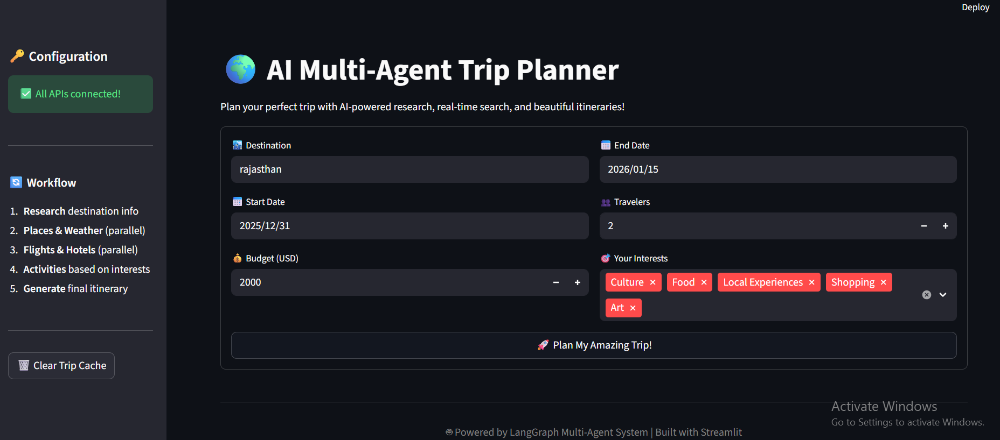
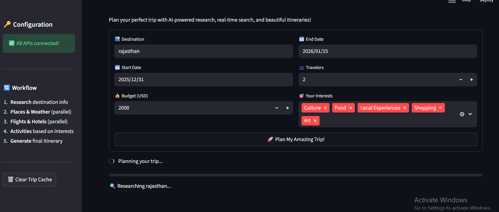

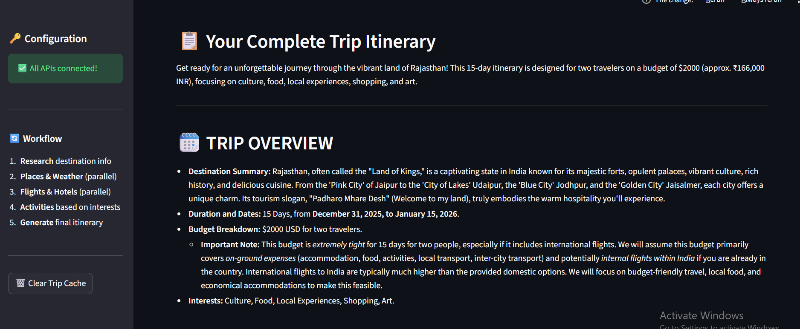
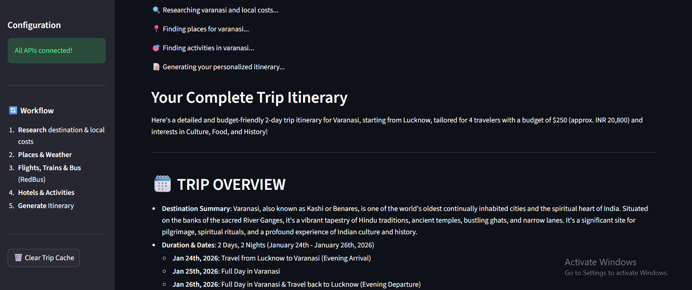
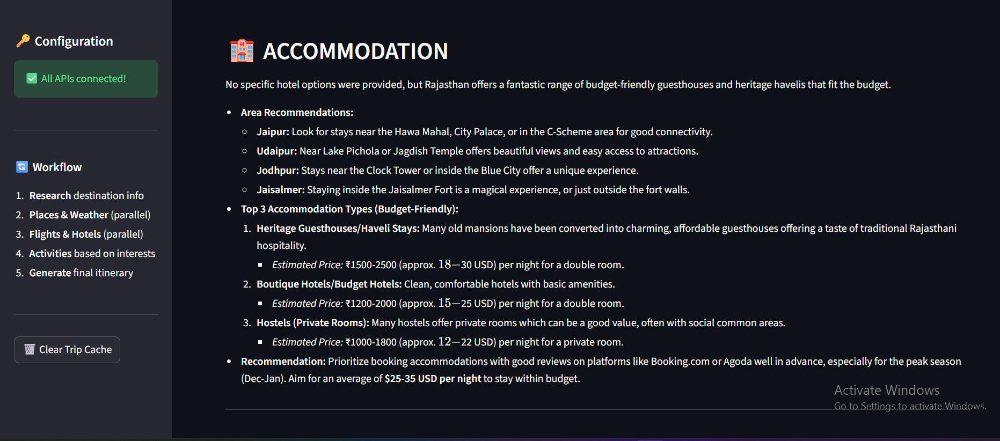
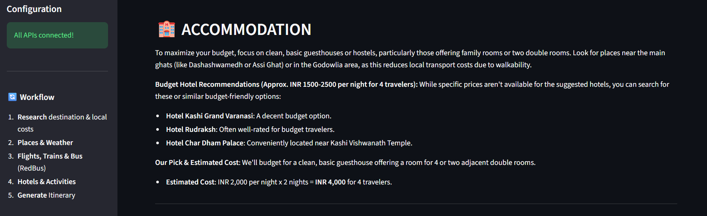
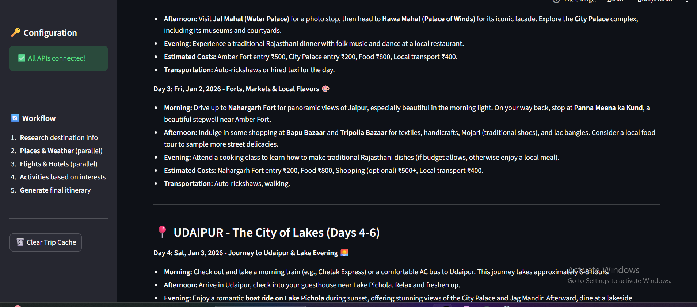

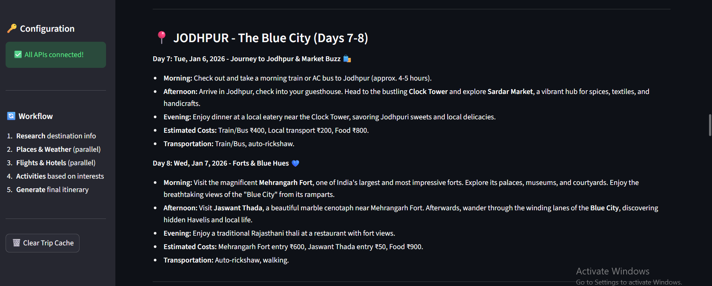
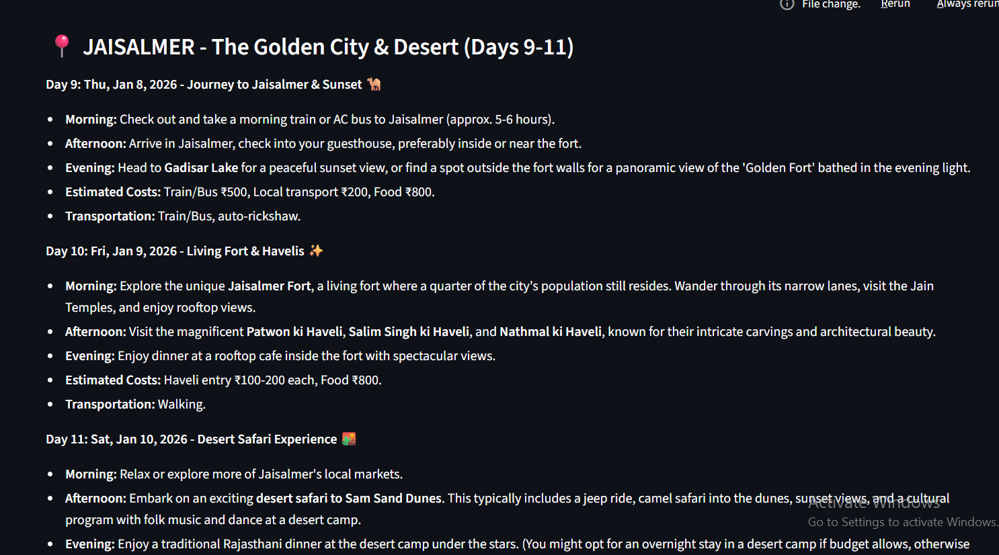
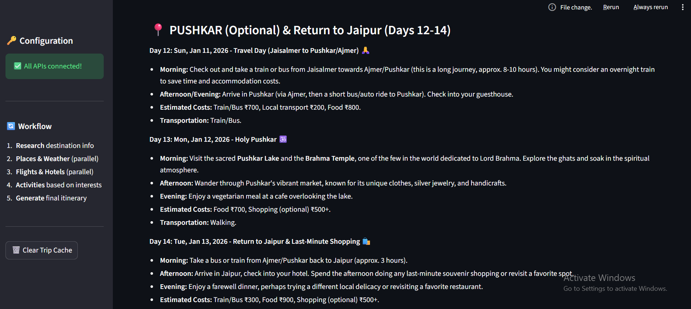
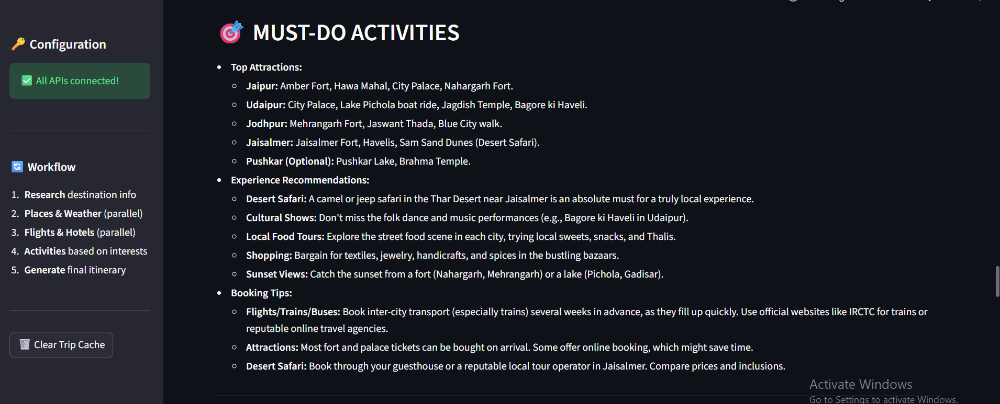
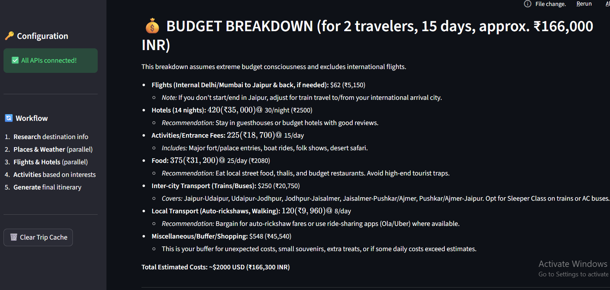

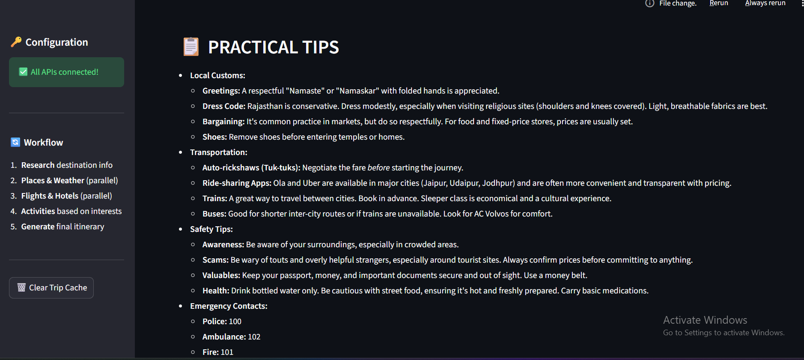
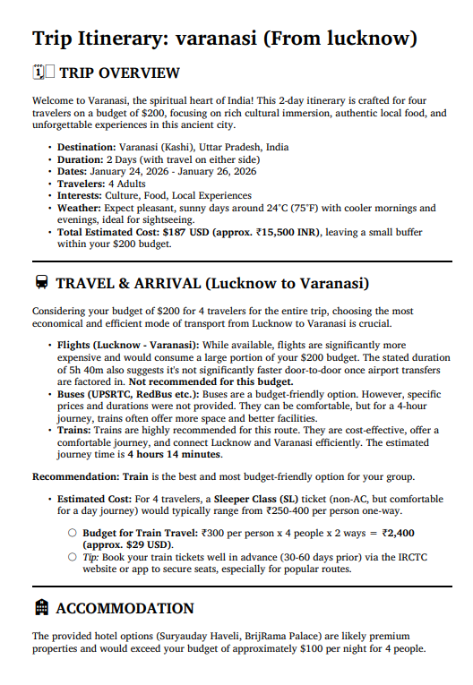
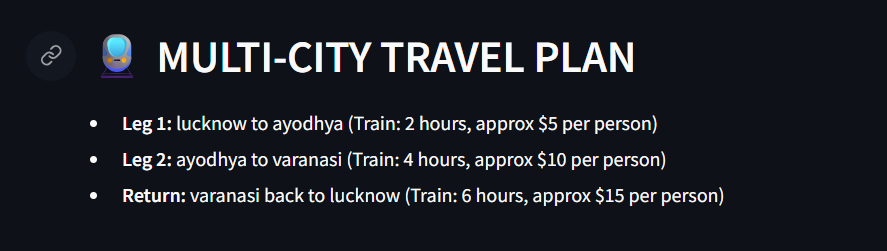

---

## 📦 Installation

### 1. Clone the Repository
```bash
git clone https://github.com/sakshivedi-1/MULTI_AGENT_TRIP_PLANNER.git
cd ai-trip-advisor

### create virtual environment
python -m venv .venv
source .venv/bin/activate   # Linux / macOS
.venv\Scripts\activate      # Windows

### Install dependencies
pip install -r requirements.txt

### API Key Configuration

This application requires credentials for Google Gemini and Tavily.

.env (for local development)
GOOGLE_API_KEY="your_google_gemini_api_key"
TAVILY_API_KEY="your_tavily_api_key"

.streamlit/secrets.toml (recommended for Streamlit)
GOOGLE_API_KEY = "your_google_gemini_api_key"
TAVILY_API_KEY = "your_tavily_api_key"


⚠️ Ensure secret files are excluded from version control.

### ▶️ Running the Application
streamlit run app.py


The application will be available at:
http://localhost:8501

## 📚 Technology Stack

LangGraph — Multi-agent orchestration

LangChain — LLM pipeline integration

Google Gemini API — Reasoning and itinerary generation

Tavily API — Real-time web search (hotels, places, activities)

Wikipedia API — Destination knowledge enrichment

Streamlit — Interactive frontend

ReportLab / Markdown-PDF — PDF generation

SMTP (Gmail) — Email delivery of itineraries

## 🔄 System Workflow
flowchart TD
    A[Research Agent] --> B[Places Agent]
    B --> C[Flights Agent]
    B --> D[Hotels Agent]
    B --> E[Weather Agent]

    C --> F[Sync Gate]
    D --> F[Sync Gate]
    E --> F[Sync Gate]

    F -->|All complete| G[Activities Agent]
    G --> H[Itinerary Agent]
    H --> I[Final Output: PDF / Text]

## Workflow Explanation

Research Agent gathers foundational destination information

Places and Weather Agents execute in parallel

Flights and Hotels Agents execute in parallel

Sync Gate ensures all parallel tasks complete

Activities Agent curates personalized experiences

Itinerary Agent assembles a structured travel plan

User Output is delivered as text or downloadable PDF


